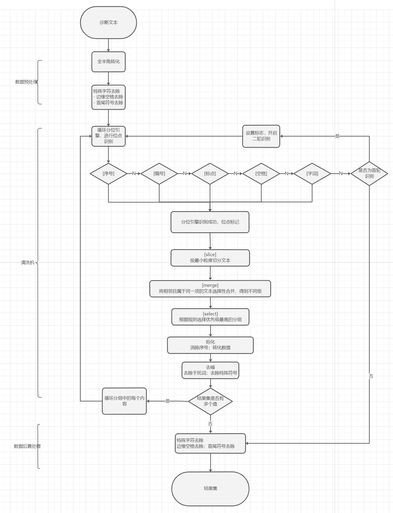

## 流程图

## 流程说明

- 在接收到待切片的文本后，会进行预处理操作，然后进入切片核心流程。
- 该流程按照`序号`、`编码`、`符号`、`空格`和`字词`的优先级顺序逐一对文本进行分位点的识别匹配。
- 如果匹配成功，则进行最小粒度的切分来得到一个分组，再根据不同分位引擎的自定义规则将分组进行条件合并，得到多个切分组。
- 最后根据对不同切分组打分计算，得出一个最优解。
- 这个结果集还会经过标准化和去噪处理，并进行二轮识别和递归循环的判断流程。
- 最后还会进行一个后置处理操作，从而实现对多结构的文本的切片处理。

